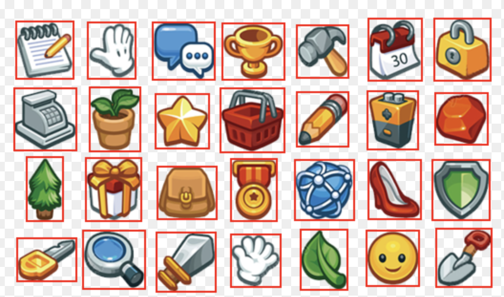
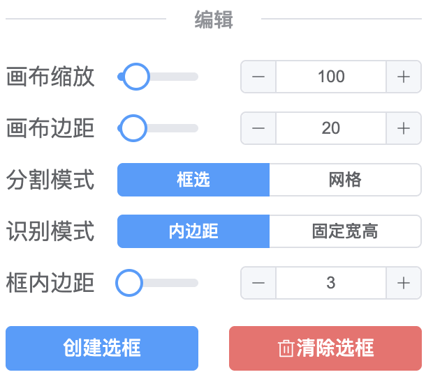
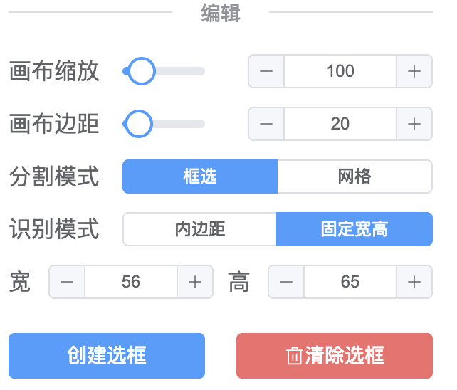
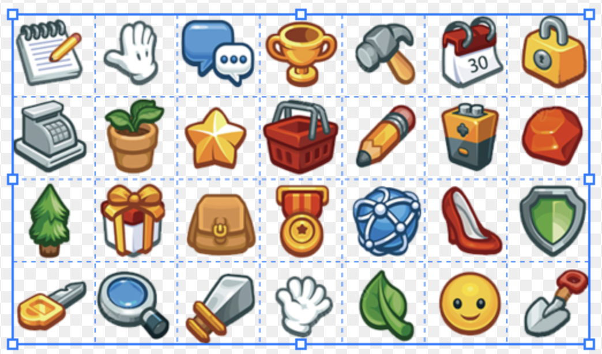
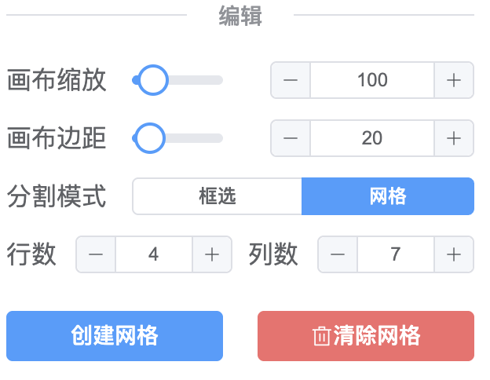
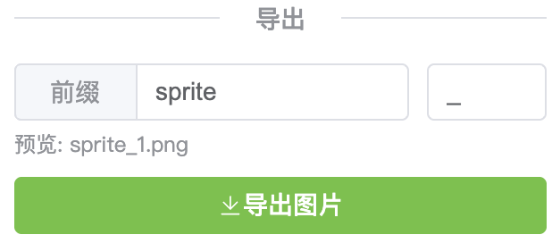

<div align="center">

[](https://github.com/ask-tao/image-splitter)

</div>

<h1 align="center" style="font-family: 'Roboto Slab', serif;">Image Splitter</h1>

<div align="center">

     

</div>

## 项目介绍

这是一个基于Web技术的图片分割工具，**100%由作者结合`Gemini`开发**。

旨在帮助`游戏开发者`或`UI设计师`快速、方便地从一张雪碧图 (`Sprite Sheet`) 中，**提取出所有独立的精灵或icon资源**，或按网格分割图片得到其切片。

本工具完全在浏览器端**本地运行**，保证了素材的安全性。

[开源地址：https://github.com/ask-tao/image-splitter](https://github.com/ask-tao/image-splitter)

## 功能特性

- **分割模式**:
    - **框选模式**: 支持**自动识别**和用鼠标拖拽创建选框。在任意位置创建、移动、缩放选框。支持按住 `Shift` 键保持纵横比缩放。
    

        - **内边距模式**:  
        
    
        - **固定宽高模式**:  
        

    - **网格模式**: 通过定义一个可缩放的网格区域及行列数，快速进行均匀的网格分割。
    

        - **行列设置**:
        

- **编辑操作**: 支持选中、移动、删除选框，并支持通过8个锚点进行缩放。
- **画布控制**: 支持画布的缩放和全局外边距调整。

- **快捷键**: 支持常用功能快捷键
    - **删除**: 使用 `Delete` 或 `Backspace` 键删除选中的选框。
    - **微调**: 使用 `↑` `↓` `←` `→` 方向键微调选框位置（1px）。按住 `Shift` 键，可快速微调（10px）。

- **导出功能**: 一键将所有选框内的图片打包成一个 `.zip` 压缩文件供下载。支持自定义导出文件名的`前缀`和`连接符`。
    

## 技术方案及其原理

本工具主要采用现代前端技术栈构建，核心原理围绕 `Canvas` 的像素级操作和图像处理算法。

- **核心框架**: **Vue 3 + Vite + TypeScript**
  - **Vue 3**: 利用其强大的响应式系统来管理选框列表、配置项等复杂状态，并通过组件化的方式构建 UI。
  - **Vite**: 提供极速的开发服务器和高效的构建能力。
  - **TypeScript**: 为项目提供了类型安全，增强了代码的可维护性。

- **UI 库**: **Element Plus**
  - 提供了一套高质量的 Vue 3 组件，用于快速构建布局、表单、按钮、对话框等界面元素。

- **图形与交互**: **HTML5 Canvas API**
  - **渲染**: 负责将用户导入的图片绘制到主画布上，并根据数据实时渲染所有的选框和锚点。
  - **交互**: 通过监听画布的 `mousedown`, `mousemove`, `mouseup` 等鼠标事件，实现选框的创建、选择、移动和缩放等所有手动编辑逻辑。
  - **图像裁剪**: 在导出和预览时，利用 `drawImage()` 方法从原始图片中精确地提取出指定选框内的像素数据。

- **核心算法：自动识别原理**
  自动识别的核心是一种**连通分量标记 (Connected-component labeling)** 算法，通过广度优先搜索 (BFS) 实现：
  1.  **像素扫描**: 将整个图片看作一个二维像素网格。算法从左上到右下逐个像素进行扫描。
  2.  **寻找“岛屿”**: 当遇到一个尚未被访问过的“不透明”像素时（Alpha > 0），就认为发现了一个新的图像块（“岛屿”），并从这个像素开始进行搜索。
  3.  **洪水填充 (Flood Fill)**: 以该像素为起点，启动**广度优先搜索 (BFS)**。算法会查找所有与它相邻（上下左右）且同样是不透明的像素，并将它们加入一个队列中。这个过程不断持续，直到探索完所有与初始点相连的像素，就像洪水蔓延过整座小岛一样。
  4.  **边界记录**: 在 BFS 的过程中，用变量记录下所有被访问过的像素中 `x` 和 `y` 坐标的最小值和最大值 (`minX`, `maxX`, `minY`, `maxY`)。这四个值就构成了该“岛屿”的最小外接矩形。
  5.  **访问标记**: 为了防止重复识别和死循环，所有被访问过的像素都会被记录在一个 `visited` 矩阵中，后续扫描会直接跳过它们。
  6.  **循环**: 当一个“岛屿”搜索完毕后，外层的像素扫描会继续进行，直到找到下一个尚未被访问的“岛屿”，重复以上过程，直到所有像素都被访问完毕。

- **导出方案**: **JSZip**
  - 为了解决浏览器对连续多次下载的限制，并提升用户体验，导出功能使用了 `JSZip` 库。
  - 程序会遍历所有选框，将每一个裁剪出的图片数据 (Blob) 添加到内存中的一个 `JSZip` 实例里。
  - 循环结束后，`JSZip` 会将内存中的所有图片生成为一个 `.zip` 压缩包的 Blob 数据，最后通过 `URL.createObjectURL` 创建一个下载链接，实现单次、可靠的批量下载。

## 桌面端应用 (Desktop Application)

本项目同样支持打包成原生的桌面端应用（macOS, Windows, Linux），具备以下特性：

- **原生体验**: 提供更沉浸的使用体验。
- **自动更新**: 应用内集成了自动更新功能，当发布新版本时，用户会自动收到通知并更新。
- **离线使用**: 无需浏览器，直接在桌面运行。

你可以在[Releases页面](https://github.com/ask-tao/image-splitter/releases) 下载最新的桌面版应用。

## 开发与构建 (Development & Building)

本项目基于 [Node.js](https://nodejs.org/) 和 [npm](https://www.npmjs.com/)。请确保您的环境中已安装它们。

1.  **安装依赖**:
    ```bash
    npm install
    ```

### Web (网页版)

- **运行开发服务器**:
    ```bash
    npm run dev
    ```
    项目将在本地开发服务器上运行，通常在 `http://localhost:5173`。

- **构建生产版本**:
    ```bash
    npm run build
    ```
    构建后的纯净 Web 应用文件将生成在 `dist` 目录下，可用于部署。

- **构建单文件**:
    ```bash
    npm run build-single
    ```
    构建后的 `index.html` 单文件将生成在 `dist-single` 目录下。
    你可以自行构建单文件html使用。

### Desktop (桌面端)

- **运行开发环境**:
    ```bash
    npm run electron:dev
    ```
    这将启动一个带调试工具的桌面端应用窗口，并支持热重载。

- **打包桌面应用**:
    ```bash
    npm run pack
    ```
    该命令会先构建 Web 内容和编译 Electron 主进程代码，然后将它们打包成适用于**你当前操作系统**的原生应用（例如在macOS上打包会生成`.dmg` 文件）。打包产物位于 `release` 目录下。

---
<center>☟公众号☟</center>
<center>
    
</center>
<center>您的关注、点赞、转发是我持续输出的动力～</center>
<center>☟支持我☟</center>
<center>
    
</center>